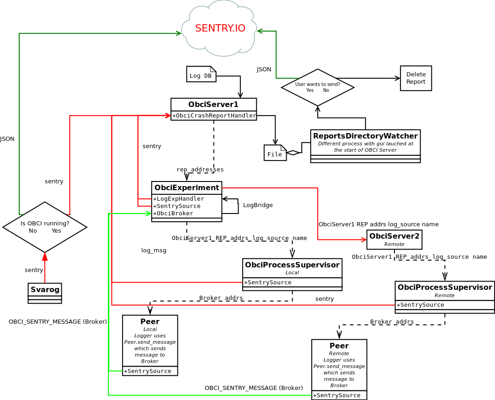
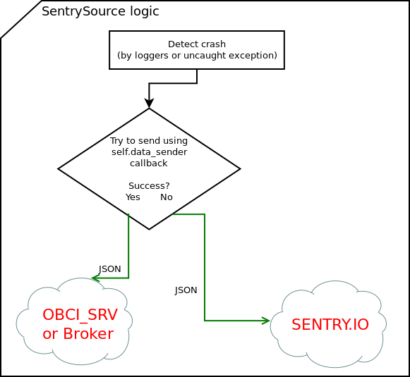

Crash report handling architecture
==================================

Crash reports handling uses existing logging architecture with little modifications:

- red arrows - BCI Framework Launcher Control Messages
- light green - Broker messages
- dark green - sending JSON reports to Sentry server using raven (using HTTPS).
- black dotted line - launching subprocess with parameters inside arguments
- LogBridge - BCI Framework Broker uses LoggingBridgeMixin to pass crash reports to LogExpHandler

Every class which can send crash reports have SentrySource initialized and provides some kind of communication callback
for the SentrySource, which can accept python dictionary with all crash report information.

SentrySource (using Raven Client) registers a python logging handler, which reacts to log records with status ERROR or higher
(it's configurable) by capturing exceptions, tracebacks and output of additional methods ``_crash_extra_tags``,
``_crash_extra_data`` and ``_crash_extra_description`` if they are available in the tracked object. Then that raport
is sent to the BCI Framework server by any means possible.  If that communication fails, report is being sent straight to
Sentry server.

Raport inside BCI Framework is being sent as serialized JSON. Timestamps are serialized as floats.

If communication to BCI Framework server succeeds then ``ObciCrashReportHandler`` receives the report and appends relevant
log records from every part of BCI Framework experiment system and places that report as a JSON file in HOME/.obci/crash_reports.

BCI Framework server at init starts independent subprocess ``ReportsController`` which scans
(using ``ReportsDirectoryWatcher``) for incoming reports. When report JSON file is available
a window appears on screen, asking user to provide some feedback. If the user agrees, the report is expanded by the
user-provided data and is moved to folder HOME/.obci/crash_reports_to_send in case he doesn't report is purged.

``ReportsController`` in another thread scans the HOME/.obci/crash_reports_to_send folder, and when one is available
uses ``raven.Client`` to send that report to Sentry server.
