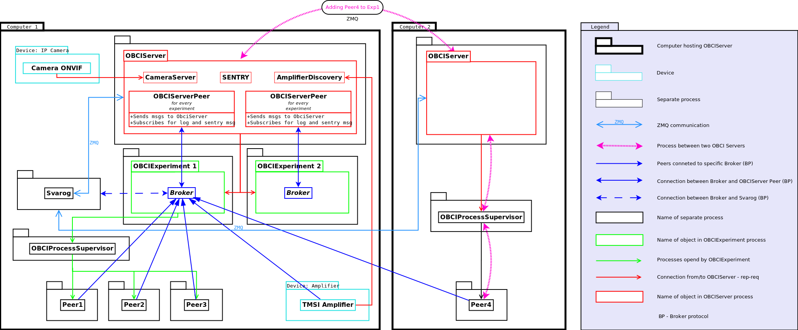

BCI Framework introduction
====================

System architecture
-------------------

Server, Broker and Peers
------------------------

**Server**
    To use BCI Framework a single instance of **Server** must be started on each
    host you are planning to run the experiment on.

    **Server** is started with ``obci srv`` command.

    **Server** is responsible for:

    * managing experiments and peers from other experiments running on its machine
    * autodiscovery of other BCI Framework experiments running on the same VLAN
    * detection of amplifiers connected to host and broadcasting this
      information to other Servers

**Broker**
    **Broker** is started once per experiment. Broker acts as a message proxy
    for peers in a single experiment.

    Every **Peer** connects to **Broker** on initialization.

**Peer**
    **Peer** is a worker unit, which communicates with other running peers and **Broker**.

    **Peer** can be started with ``obci run_peer peer.py`` command, but it is
    strongly recommended to start peers automatically, as a part of experiment.

    Typical examples of peers are:

    * EEG signal amplifiers
    * EEG signal filters
    * signal displays

    Each peer has its own **configuration file**. It stores necessary parameters
    and defines dependencies on other peers in the system.

Experiment
----------

To perform some useful work you need to create and run an experiment.

**Experiment** is a set of running **Peers** and a **Broker**. Each peer can
be identified by its assigned ``peer_id``, thus allowing for launching multiple
instances of the same peer.

Peer IDs, peer program paths and peer configurations are predefined in
**experiment definition file** or **scenario file***.

**Experiment definition file** is a text file for defining an experiment. It
contains a list of peers, assignments of ``peer_id`` and paths to peer
configurations.
