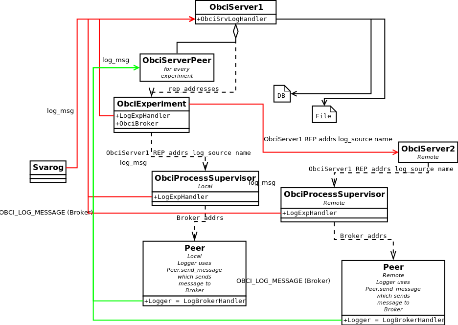

Logging architecture
====================

BCI Framework logging architecture diagram:

- red arrows - BCI Framework Launcher Control Messages
- green - Broker messages
- black dotted line - launching subprocess with parameters inside arguments
- BCI Framework ServerPeer - BCI Framework Experiment uses BCI Framework ServerPeer to pass log records to BCI Framework Server

``obci_experiment`` sets up a log source name for whole experiment, which is then used inside BCI FrameworkServerPeer, and Experiment, and Process Supervisors.

``obci_experiment`` has a root logger setup which sends all log records to parent ``obci_server``. When BCI Framework Experiment starts peers (both remote and local) it provides Process Supervisor with LogSourceName and the parent_issue_id BCI Framework Servers REP addresses, which can handle log messages. BCI Framework Experiment waits for BCI Framework ServerPeer to connect to Broker. BCI Framework ServerPeer subscribe for log and sentry messages. BCI Framework ServerPeer passes sentry_msg and log_msg to BCI Framework Server. Peers send log messages. Broker address is provided by Process Supervisor, which forms it using address of the main BCI Framework server (Broker has its port defined in configuration).

At the end of the log flow main BCI Framework server (which started the experiment) get's all the log records as sentry_msg and log_msg messages and writes them to files (one file for log source) and/or database.

Possible log sources:

- BCI Framework server
- Svarog
- BCI Framework Experiment (all peers and process supervisors share source name)

